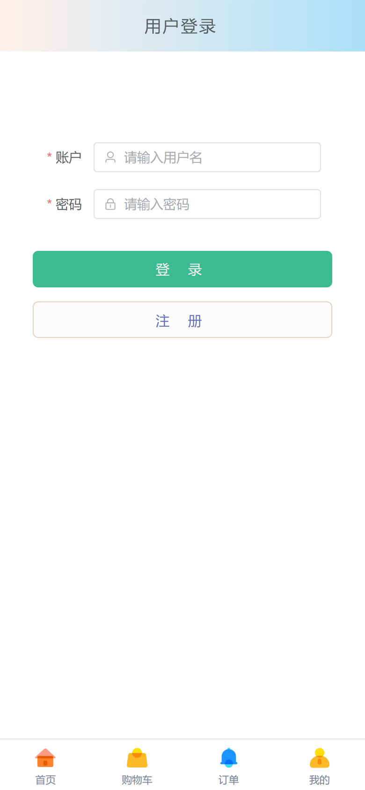
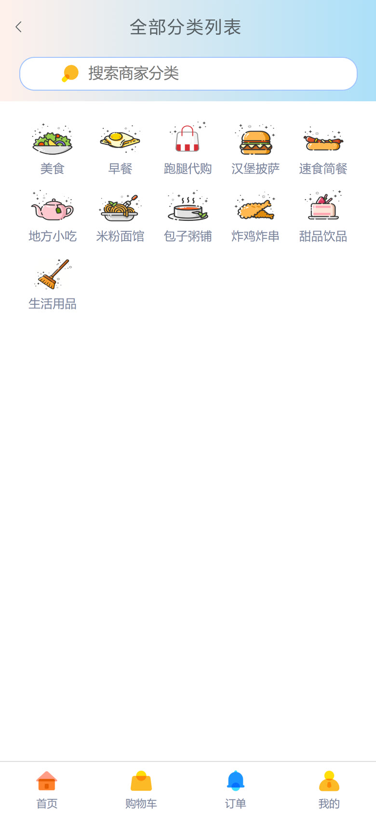
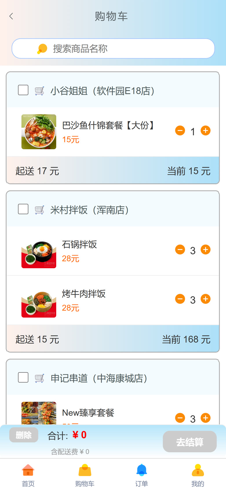
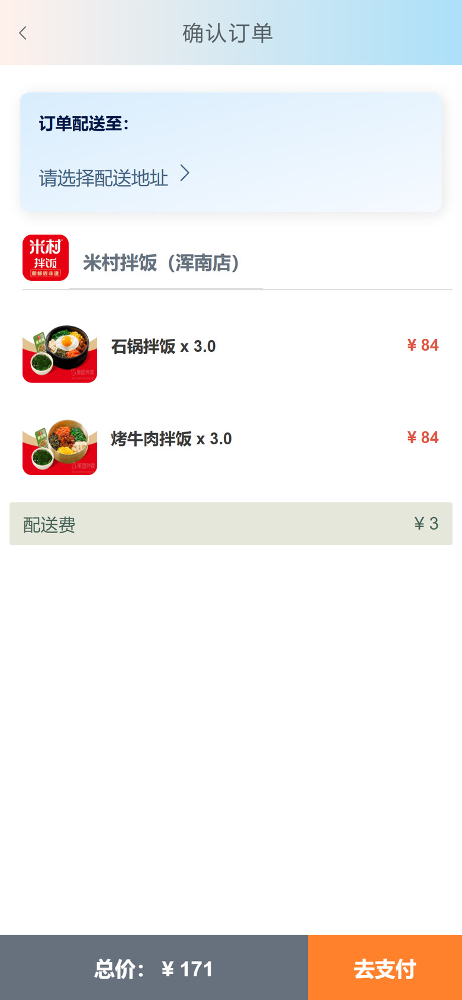
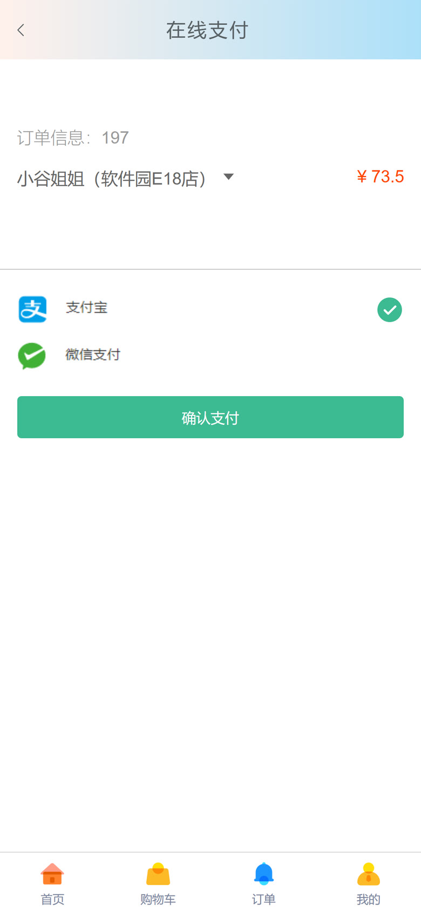
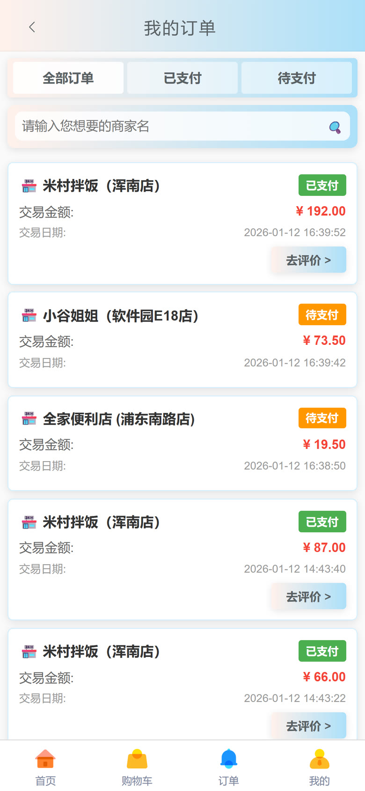
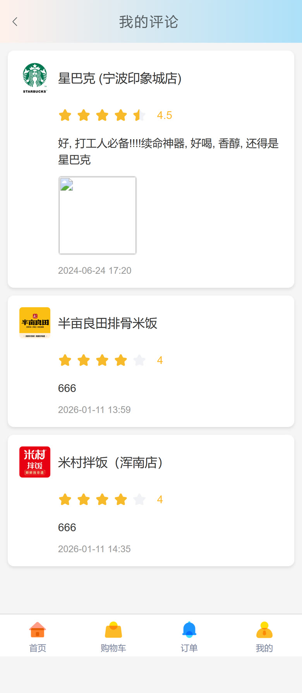
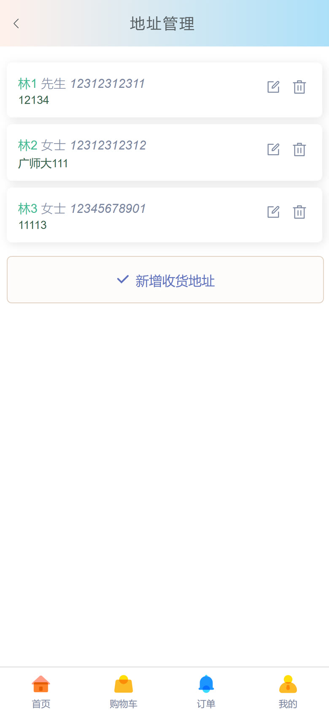
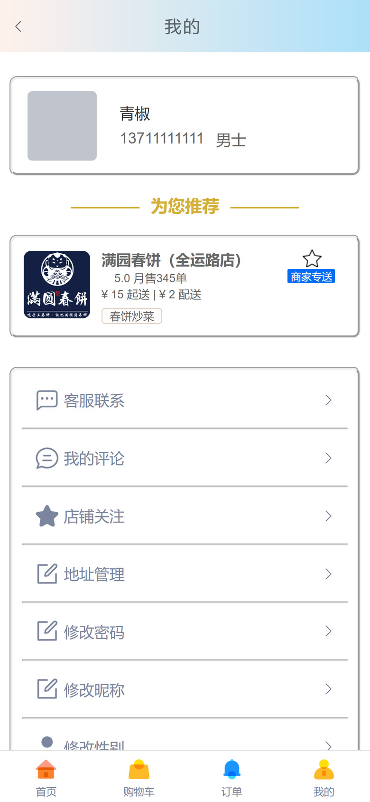
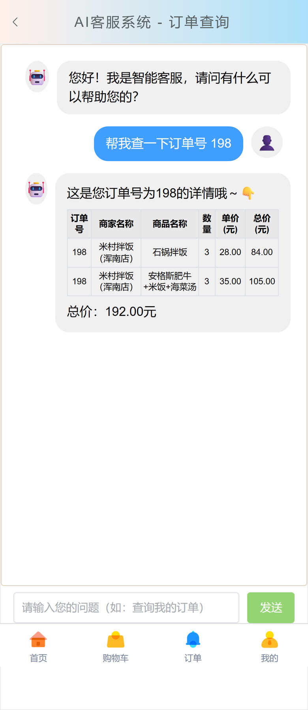

# 移动端智能外卖点餐系统

面向手机端的外卖点餐 H5 应用，前后端分离。用户可浏览商家与商品、加入购物车、下单支付、管理订单与收货地址，并可向 AI 客服查询订单。

## 演示


### 界面截图

| 登录 | 首页 | 分类浏览 | 商家点餐 |
| :---: | :---: | :---: | :---: |
|  |  |  |  |
| **购物车** | **确认订单** | **在线支付** | **我的订单** |
|  |  |  |  |
| **我的评论** | **地址管理** | **个人中心** | **AI 客服** |
|  |  |  |  |

> 截图与动图均为项目实际运行画面，数据取自本地数据库。

## 技术栈

| 模块 | 技术选型 |
| --- | --- |
| 前端 | Vue 3 + Vue Router 4 + Element Plus + Axios + qs，Vue CLI 5 构建 |
| 前端（AI 消息） | marked —— 渲染大模型返回的 Markdown 表格 |
| 业务后端 `go2-serve` | Spring Boot 2.3.7 + MyBatis-Plus，端口 10001 |
| AI 后端 `go-chat-ai` | Spring Boot 3.4.3 + Spring AI，端口 10002 |
| 大模型 | 阿里云百炼 qwen-max（兼容 OpenAI 协议，可换成任意兼容服务） |
| 数据库 | MySQL 8，库名 `system` |

## 核心功能

### 用户端

- 注册与登录
- 首页分类导航、商家列表、按名称搜索
- 商家详情点餐：查看商品、加入购物车、调整数量
- 购物车：按商家分组，实时计算起送价与配送费
- 下单与支付：确认订单、选择收货地址、在线支付
- 订单管理：按状态筛选、查看明细、评价
- 评论、收藏、收货地址维护

### AI 客服（Spring AI Function Calling）

AI 客服不是普通的对话机器人，而是**能查数据库的工具调用智能体**：

1. 系统提示词限定它只处理订单查询，要求先从用户输入中提取订单编号；
2. 通过 Spring AI 的 `@Tool` 注解注册 `queryOrders` 工具，模型自主决定调用；
3. 工具内部用 MyBatis-Plus 查询订单主表与明细表；
4. 模型把查询结果整理成 Markdown 表格返回，前端用 marked 渲染成表格。

```text
我：帮我查一下订单号 198
AI：这是您订单号 198 的信息哦～
    订单号 | 商家名称        | 商品名称            | 数量 | 单价  | 总价
    198   | 米村拌饭（浑南店）| 石锅拌饭            | 3    | 28.00 | 84.00
    198   | 米村拌饭（浑南店）| 安格斯肥牛套餐       | 3    | 35.00 | 105.00
    订单总价：192.00 元
```

### 接口概览

业务后端共 10 个控制器、35 个接口：

| 模块 | 接口数 | 说明 |
| --- | --- | --- |
| 账号 `account` | 6 | 登录、注册、注销、改密、改资料 |
| 商家 `business` | 3 | 列表、按分类查询、详情 |
| 分类 `category` | 1 | 分类列表 |
| 商品 `goods` | 1 | 按商家查询商品 |
| 购物车 `cart` | 6 | 增删改查、按账号/商家查询 |
| 订单 `orders` | 6 | 下单、改状态、按账号查询、订单明细 |
| 订单明细 `ordersdetailet` | 1 | 按订单号查询明细 |
| 评论 `comment` | 3 | 新增、按用户/商家查询 |
| 收藏 `favorite` | 4 | 添加、取消、列表、是否收藏 |
| 收货地址 `deliveryaddress` | 4 | 列表、新增、修改、删除 |

## 项目结构

```
├── 前端项目/                     移动端 H5（Vue 3）
│   └── src/
│       ├── views/                18 个页面：登录注册、首页、商家、购物车、下单、支付、
│       │                         订单、评论、收藏、地址、个人中心、AI 客服
│       ├── components/           公共组件（Header / Footer / Search 等）
│       ├── router/               路由配置
│       ├── api/                  Axios 实例与接口地址
│       └── assets/               商品与商家图片素材
├── 后端项目/
│   ├── go2-serve/                业务后端（Spring Boot 2.3.7，端口 10001）
│   │   └── src/main/java/com/go2/
│   │       ├── controller/       10 个控制器
│   │       ├── service/          业务层与实现
│   │       ├── mapper/           MyBatis-Plus Mapper
│   │       ├── entity/           实体类
│   │       └── config/           配置类
│   └── go-chat-ai/               AI 问答后端（Spring Boot 3.4.3，端口 10002）
│       └── src/main/java/com/go/
│           ├── controller/       客服接口
│           ├── tool/             OrderTools —— Function Calling 工具
│           ├── constants/        系统提示词
│           └── service/ mapper/  订单查询
├── docs/                         演示动图与界面截图
└── system.sql                    数据库结构与数据（11 张表）
```

## 本地运行

### 1. 导入数据库

```bash
mysql -u root -p -e "CREATE DATABASE system DEFAULT CHARSET utf8mb4"
mysql -u root -p system < system.sql
```

### 2. 配置后端

两个后端的 `application.yaml` 含数据库密码与 API Key，未纳入版本管理。复制示例文件后填入自己的信息：

```bash
cp 后端项目/go2-serve/src/main/resources/application.example.yaml 后端项目/go2-serve/src/main/resources/application.yaml
cp 后端项目/go-chat-ai/src/main/resources/application.example.yaml 后端项目/go-chat-ai/src/main/resources/application.yaml
```

AI 后端的 `api-key` 需要填自己的大模型服务密钥（默认按阿里云百炼的兼容接口配置）。

### 3. 启动两个后端

```bash
cd 后端项目/go2-serve && ./mvnw spring-boot:run    # 业务接口，端口 10001
cd 后端项目/go-chat-ai && ./mvnw spring-boot:run   # AI 问答，端口 10002
```

> 环境要求：`go2-serve` 使用 Spring Boot 2.3.7，需要 JDK 8 或 11；`go-chat-ai` 需要 JDK 17 及以上。

### 4. 启动前端

```bash
cd 前端项目
npm install
npm run serve
```

页面为移动端布局，建议用手机浏览器访问；在桌面浏览器中请按 `F12` 打开开发者工具，切换到移动设备视图（如 iPhone）查看，否则布局会被拉伸。

前端默认调用 `http://localhost:10001`（业务接口）与 `http://localhost:10002/ai/chat`（AI 问答），如需改端口请同步修改 `前端项目/src/api/index.js` 与 `前端项目/src/views/Chat.vue`。

## 测试账号

初始密码均为 `123123`：

| 账号 | 姓名 | 可借数据 |
| --- | --- | --- |
| `13711111111` | 青椒 | 22 笔订单（数据最全，推荐） |
| `18812345678` | 先睡一觉 | 4 笔订单 |
| `12312312312` | 林某 | 无订单 |

> 初始数据中的 `16677889900` 为禁用状态。

## 说明

- 密码在数据库中以加盐 MD5 存储，仅用于课程演示。
- `application.yaml` 因含本机数据库密码与大模型 API Key，已加入 `.gitignore`，请按 `application.example.yaml` 自行创建。

